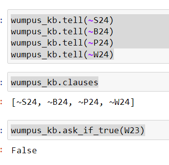
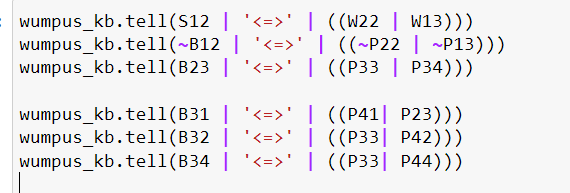
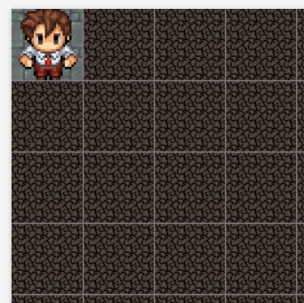

# Inferencing Propositional Logic Sentences

## AIM

To develop python code to inference propositional logic sentences to solve the Wumpus World problem.

## THEORY:
The Wumpus World's agent is an example of a knowledge-based agent that represents Knowledge representation, reasoning , and planning. A Knowledge-Based agent links general knowledge with current percepts to infer hidden characters of the current state before selecting actions.


## DESIGN STEPS
### STEP 1:
Importing required logical and utils files.
### STEP 2:
Defining a knowledge base class with functions on a python file.
### STEP 3:
creating a new knowledge base for agent, with a function called propKB().
### STEP 4:
Mentioning the labels in the wumpus game cell for location in the function of expressions.
### STEP 5:
Using wumpus_kb.tell() to define the environment of the wumpus game.
### STEP 6:
Using propositional Logic defines the possibility of agent's next move.
### STEP 7:
Using wumpus_kb.ask_if_true() to get the result based on TRUE value.
## PROGRAM
```python
from utils import *
from logic import *
char=['P','B','W','S']
abc=''
ind=[1,2,3,4]
for i in char:
    for x in ind:
        for y in ind:
            abc= abc+(str(i)+str(x)+str(y))+','
abc= abc[0:-1]
abc
wumpus_kb = PropKB()
P11,P12,P13,P14,P21,P22,P23,P24,P31,P32,P33,P34,P41,P42,P43,P44,B11,B12,B13,B14,B21,B22,B23,B24,B31,B32,B33,B34,B41,B42,B43,B44,W11,W12,W13,W14,W21,W22,W23,W24,W31,W32,W33,W34,W41,W42,W43,W44,S11,S12,S13,S14,S21,S22,S23,S24,S31,S32,S33,S34,S41,S42,S43,S44= expr('P11,P12,P13,P14,P21,P22,P23,P24,P31,P32,P33,P34,P41,P42,P43,P44,B11,B12,B13,B14,B21,B22,B23,B24,B31,B32,B33,B34,B41,B42,B43,B44,W11,W12,W13,W14,W21,W22,W23,W24,W31,W32,W33,W34,W41,W42,W43,W44,S11,S12,S13,S14,S21,S22,S23,S24,S31,S32,S33,S34,S41,S42,S43,S44')
wumpus_kb.tell(~P11)
wumpus_kb.tell(~S11)
wumpus_kb.tell(~W11)
wumpus_kb.tell(~B11)
wumpus_kb.tell(~S12)
wumpus_kb.tell(~B12)
wumpus_kb.tell(~P12)
wumpus_kb.tell(~W12)
wumpus_kb.tell(~P13)
wumpus_kb.tell(~S13) 
wumpus_kb.tell(~W13)
wumpus_kb.tell(~B13)
wumpus_kb.tell(~S14)
wumpus_kb.tell(~B14)
wumpus_kb.tell(~P14)
wumpus_kb.tell(~W14)
wumpus_kb.clauses
wumpus_kb.ask_if_true(P21)
wumpus_kb.tell(~S24)
wumpus_kb.tell(~B24)
wumpus_kb.tell(~P24)
wumpus_kb.tell(~W24)
wumpus_kb.clauses
wumpus_kb.ask_if_true(W23)
wumpus_kb.tell(~S21)
wumpus_kb.tell(~B21)
wumpus_kb.tell(~P21)
wumpus_kb.tell(~W21)
wumpus_kb.clauses
wumpus_kb.ask_if_true(B21)
wumpus_kb.tell(~S22)
wumpus_kb.tell(~B22)
wumpus_kb.tell(~P22)
wumpus_kb.tell(~W22)
wumpus_kb.clauses
wumpus_kb.ask_if_true(B22)
wumpus_kb.tell(B34)
wumpus_kb.tell(B23)
wumpus_kb.tell(B31)
wumpus_kb.tell(B32)
wumpus_kb.tell(B44)
wumpus_kb.tell(B42)
wumpus_kb.tell(S12 | '<=>' | ((W22 | W13)))
wumpus_kb.tell(~B12 | '<=>' | ((~P22 | ~P13)))
wumpus_kb.tell(B23 | '<=>' | ((P33 | P34)))

wumpus_kb.tell(B31 | '<=>' | ((P41| P23)))
wumpus_kb.tell(B32 | '<=>' | ((P33| P42)))
wumpus_kb.tell(B34 | '<=>' | ((P33| P44)))
wumpus_kb.clauses
wumpus_kb.ask_if_true(~P41)
```
## OUTPUT
### Checking in algorithm:


### Propositional logic:

### Starting of the game:

### Mid of the game:

### end of the game:

## RESULT
Thus, the developed agent can predict the next move in the wumpus game using propositional logic sentences .


